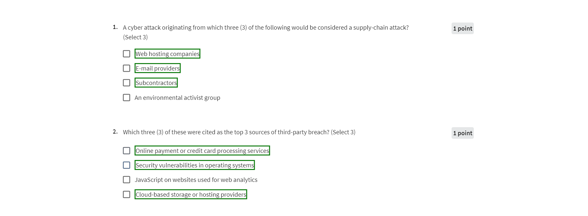

# VN
## Tư động đưa ra đáp án trong coursera  

## Cài đặt   
Thay đổi "API KEY CHATGPT" bằng API thực tế của bạn trong 'service-worker.js'
1. truy cập chrome://extensions
2. bật chế độ Nhà phát triển
3. bấm vào tải giải nén
4. chọn thư mục tiện ích mở rộng
5. vào trang thi trong Coursera
6. nhấp vào biểu tượng tiện ích mở rộng và đợi một lát

# EN
## Installation 
Change "API KEY CHATGPT" with your actual API in 'service-worker.js'
1. go to chrome://extensions
2. turn on Developer mode
3. click load unpack
4. select extension folder
5. go to exam page in coursera
6. click on extension icon and wait a few moments